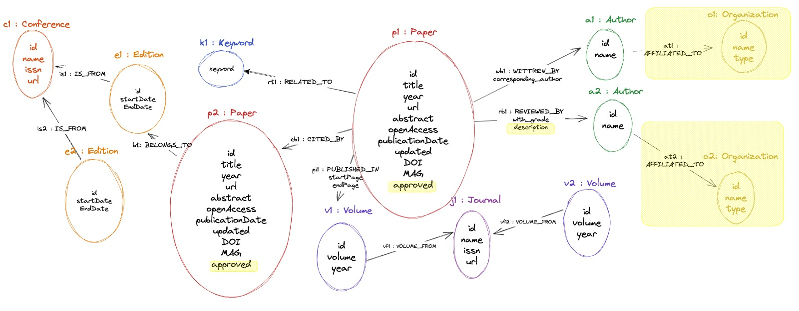

# Property Graph Lab - Semantic Data Management
### Authors:
- Daniel Cantabella (daniel.cantabella.cantabella@estudiantat.upc.edu)
- Gabriel Zarate (gabriel.zarate@estudiantat.upc.edu)
# A. Modeling, Loading, Evolving
The graph in this project is focused on collecting data related to the scientific paper ecosystem. 
This includes information such as papers, authors, conferences, journals, and keywords. 
By using Neo4j as our graph database, we can easily model and visualize the relationships between these entities. 
Additionally, we will be getting familiar with Cypher, the query language used in Neo4j, to efficiently query and 
process the data within the graph. The ultimate goal is to build a robust and flexible graph database that can be used 
to analyze various aspects of the scientific paper ecosystem. In order to set up properly the database, please follow the instructions in
[Setting up Neo4j Server and program execution](#setting-up-neo4j-server-and-program-execution)

## A.1. Modeling
This part of the project consists on modeling the graph data in order to get an overview of our database schema.
We designed our graph database based on some assumptions we made and designed the different nodes and relationships shown in the following image:


### NODES & ATTRIBUTES
Here we describe each node in the graph database:
* **Author** &rarr; an author can be itself a paper author or a paper reviewer. An author cannot be a reviewer of their own papers.
   * _Attributes_:
     * id &rarr; (e.g., id: 2168630911)
     * name &rarr; (e.g., name: Larisa Renteria)

     
* **Paper** &rarr; scientific paper
  * A paper can only belong either to one journal or to one conference.
  * A paper can have multiple authors but only one corresponding author.
  * A paper can have multiple reviewers
  * _Attributes_:
    * id &rarr; identifier of the paper (e.g., id: 171188162)
    * title &rarr; title of the paper (e.g., title: Metafisica delle forme simboliche. Note su Cassirer inedito)
    * year &rarr; publication year of the paper (e.g., year: 1995) 
    * url &rarr; url of the paper (e.g., url: https://www.semanticscholar.org/paper/821cb451d598cd93746194acb16c3e04272cdbbc)
    * abstract &rarr; abstract text of the paper (e.g., abstract: Objective: To screen the antifungal activity of seed extracts of...)
    * openAccess &rarr; boolean indicating if the paper has open access or not (e.g., openAcces: false)
    * publicationDate &rarr; publication date of the paper (e.g., publicationDate: "2011-08-01")
    * updated &rarr; (e.g., updated: 2022-02-08T16:57:52.072Z)
    * DOI &rarr; DOI code of the paper (e.g., DOI: 10.1136/ebmh.12.1.e1)
    * MAG &rarr; Microsoft Academic Graph database code (e.g., MAG: 2463363854)

* **Keyword** &rarr; a paper can contain multiple keywords and a keyword can be contained in many papers
  * _Attributes_:
    * keyword &rarr; name of the keyword (e.g., computational biology)

* **Volume** &rarr; a journal volume that can publish many papers
  * _Attributes_:
    * id &rarr; identifier of the volume (e.g., id: fz3guy7i-odk0-62rp-sl7p-0fy9ex3ikwii)
    * volume &rarr; volume number of the journal (e.g., volume: 2)
    * year &rarr; publication year of the volume (e.g., year: 2021)


* **Journal** &rarr; one journal could contain many journal volumes
  * _Attributes_:
    * id &rarr; identifier of the journal (e.g., id: 3b2c751d-4ed2-4da6-be71-4c19769543bf)
    * name &rarr; name of the journal (e.g., name: Florida Media Quarterly)
    * issn &rarr; International Standard Serial Number of the journal (e.g., issn: 1085-1976)
    * url &rarr; URL of the journal (e.g., url: http://www.floridamedia.org/)


* **Edition** &rarr; a conference edition that can held many papers
  * _Attributes_:
    * id &rarr; identifier of the edition (e.g., id: tiblgnnj-fed2-k6g0-n5m8-0ddbexw5ikly)
    * startDate &rarr; starting date of the conference edition (e.g., startDate: "2011-05-06")
    * endDate &rarr; end date of the conference edition (e.g., endDate: "2011-05-14")


* **Conference** &rarr; one conference could contain many conference editions
  * _Attributes_:
    * id &rarr; identifier of the conference (e.g., id: 04d55eb2-9d8a-4366-baad-c0838563c870)
    * name &rarr; name of the conference (e.g., name: The Irish Review)
    * issn &rarr; International Standard Serial Number of the conference (e.g., issn: 0790-7850)
    * url &rarr; URL of the conference (e.g., url: https://theirishreview.com/)

### EDGES
* **WRITTEN_BY** &rarr; from **Paper** to **Author** nodes. 
  * _Attributes_:
    * corresponding_author &rarr; boolean indicating if it is **corresponding author** or not.

* **REVIEWED_BY** &rarr; from **Paper** to **Author** nodes. 
  * This author is not actually an author of the paper but its reviewer.
  * An author cannot be the reviewer of its own paper.
  * _Attributes_:
    * with_grade &rarr; integer **grade** of the review from 1 to 5. Here we assume reviewers mark papers with a grade instead of an approved/cancelled status.

* **RELATED_TO** &rarr; from **Paper** to **Keyword** nodes. 
  * A paper can contain many keywords and a keyword can be related with many papers.
  
* **CITED_BY** &rarr; from **Paper** to **Paper** node.
  * A paper cannot be cited by itself.
  
* **PUBLISHED_IN** &rarr; from **Paper** to **Volume** nodes.
  * Many papers can be published in a journal volume. 
  * _Attributes_:
    * startPage &rarr; **starting** **page** where the paper appears.
    * endPage &rarr; **ending** **page** where the paper appears.
    
* **VOLUME_FROM** &rarr; from **Volume** to **Journal**
  * A journal can be related with many volumes. A volume can be related to **only** one journal.
  
* **BELONGS_TO** &rarr; from **Paper** to **Edition**.
  * Many papers can belong to the same conference edition. 
  
* **IS_FROM** &rarr; from **Edition** to **Conference**.
  * A conference can have many editions. An edition can be related to **only** one conference.


### GENERAL JUSTIFICATIONS AND ASSUMPTIONS
* The structure of the graph database was made like this in order to avoid storing the same data more than once and to have an easy understanding.
* As many papers can be related to the same Keyword, representing them as nodes allows for normalizing the data to avoid repetitions. Representing keywords as nodes provides greater flexibility in the types of queries that can be executed. For example, it becomes possible to query the database for all papers that contain a specific keyword, or to identify papers that share multiple keywords.

* Linking a paper to a conference edition or journal volume was done because it was assumed that one journal has many volumes and a conference has many editions, so one paper can only belong to one of these volumes or editions.
* The reviews structure was made by only linking the reviewers to the paper because of the mentioned statement before, that one paper belongs to only one edition or volume so it would only have one review associated, so there was no need to have a new node for review and the information per review can be stored on the edge `REVIEWED_BY`.
* There was no need to have two different links for paper an author to differentiate the corresponding one, by adding a boolean to the edge was enough

## A.2. Instantiating/Loading
Part of the data we loaded into our graph came from [Semantic Scholar](https://www.semanticscholar.org/).
The data consisted of a sample of 100 different examples for each of the contained CSV files. Each CSV file contained information either from scientific papers, from authors or from venues (i.e., conferences and journals).
Each of these files contained relationships to other instances, but none of those relationships matched the IDs of the instances in the other files. For this reason, and because our sample was very small (i.e. 100 samples each file), we 
decided to artificially generate both the relationships and the necessary data not contained in the samples.
Here we show the list of the programs we implemented to download and generate the necessary data for the project:
* [a2_getSampleData.py](functions/a2_getSampleData.py): this file uses the Semantic Scholar sample API to get the desired datasets as jsonl.gz files.
* [a2_generateCSV.py](functions/a2_generateCSV.py): this file reads the jsonl.gz files from the Semantic Scholar API and exports them into CSV files.
* [a2_splitVenues.py](functions/a2_splitVenues.py): this file reads the venues file and generates two new files: one with the list of journals and other with the conferences.
* [a2_generateRelations.py](functions/a2_generateRelations.py): this file generates the artificial relationships between the different nodes, and exports them into CSV files.
* [a2_importData2Database.py](functions/a2_importData2Database.py): this file contains the connection to the neo4j database. It executes the constraints and the creation of the nodes and edges by loading the data from previously generated CSV files.

**_NOTE_**: Since the relationship between nodes were randomly generated, we didn't expect it to make any sense. 
The objective of this part was to generate the data to be able to work later with our database.

## A.3. Evolving the graph
In this section we evolved our graph. The different updates are highlighted in the following image:



To evolve the graph and allow for the storage of additional information, such as reviews from reviewers and the approval or cancellation status of each paper, we split the work into two parts. Both parts are contained in [A3_Evolving.py](functions/a3_evolving.py).

In the first part, we updated the data model to include a new attribute "**description**" in `REVIEWED_BY` edges.
Since there was no data giving the description of any review, it was artificially generated in [reviews.csv](sample_csv/reviews.csv) and randomly assigned to each review relationship in [reviewed-by.csv](sample_csv%2Freviewed-by.csv) by using [generateRelations.py](functions/a2_generateRelations.py).
Once the data was prepared, we added the description of each review with Cypher:
```{Cypher}
LOAD CSV WITH HEADERS FROM "file:///reviewed-by.csv" AS rowReview
MATCH (p:Paper{id: toInteger(rowReview.paperID)})-[r: REVIEWED_BY]->(a:Author{id:toInteger(rowReview.reviewerID)})
SET r.description = rowReview.review;
```
In the second part, we updated the data model to include a new boolean attribute `approved` in Paper nodes.
This boolean was set to True in those cases where the majority of reviewers supported acceptance.
To do this, we assumed a review with a grade of 3 or higher was accepted by the corresponding reviewer.
To achieve the update of the model, we ran a query that checks for each paper, if most of the reviewers grade were greater than or equal to 3. 
```{Cypher}
MATCH (p:Paper)
OPTIONAL MATCH (p)-[e:REVIEWED_BY]->(:Author)
WITH p, COUNT(e) as numRev, COUNT(CASE WHEN e.with_grade>2 THEN 1 END) as numApp
WHERE numRev/2 < numApp
SET p.approved = true
```
Due to the graph model design, it was only necessary to store the status of a paper in its node, because it was assumed that one paper can only belong to one Journal Volume or one Conference Edition, so there is only one evaluation.

Later on, we wanted to extend the model to store the affiliation of the author. Hence, an author could be affiliated to an organization which could be a university or a company.
In order to deal with this update, we extended our model in order to include new `Organization` nodes. Those Organization node were designed to have the following attributes: id (e.g., id: OY1ibQYV9f), name (e.g., name: Bruker Corporation ) and type (e.g., type: company).
Note that `type` attribute could only be either **university** or **company**.
The addition of these nodes implied the addition of a new edge `AFFILIATED_TO` going from Author to Organization nodes. 
We did not split companies and universities since both would have the same attributes and having an attribute `type` does not difficult the queries over it.
Just filtering by `type` attribute instead of by nodes allows us to have the model more compacted and interpretable. This way we avoid having two different types of nodes.
Again, as we did not have data from universities nor companies, we created artificial data in CSV containing names and ids of the organizations. 
Those files can be seen in [universities.csv](sample_csv%2Funiversities.csv) and [companies.csv](sample_csv%2Fcompanies.csv). 
The relations between authors and organizations was randomly assigned in [affiliated-to.csv](sample_csv%2Faffiliated-to.csv) by using [generateRelations.py](functions/a2_generateRelations.py).
Once the data was prepared, we extended the model with Cypher:
```
CREATE CONSTRAINT companyIdConstraint FOR (organization:Organization) REQUIRE organization.id IS UNIQUE;

LOAD CSV WITH HEADERS FROM "file:///companies.csv" AS rowCompany
CREATE (c:Organization {id: rowCompany.companyid, name:rowCompany.company, type:'company'});

LOAD CSV WITH HEADERS FROM "file:///universities.csv" AS rowUniversity
CREATE (u:Organization {id: rowUniversity.universityid, name:rowUniversity.university, type:'university'}); 

LOAD CSV WITH HEADERS FROM "file:///affiliated-to.csv" AS rowAffiliated
MATCH(a:Author{id:toInteger(rowAffiliated.authorID)})
MATCH(o:Organization{id:rowAffiliated.affiliation})
CREATE (a)-[:IS_AFFILIATED_TO]->(o);
```
Note that we added a constraint in order to have unique organizations with unique IDs.
There was no reason to split Organization nodes into Universities and Companies so we grouped them into one node and setting them different type attributes.

# B. Querying
In this section we wanted to exploit the graph data and to put in practice querying graph data.
Here we include the queries we used for each of the petitions:
1. Find the top 3 most cited papers of each conference.
```
MATCH (c:Conference)<-[:IS_FROM]-(e:Edition)
MATCH (e)<-[:BELONGS_TO]-(p:Paper)
MATCH (p:Paper)-[cb:CITED_BY]->(:Paper)
WITH c, p, count(cb) as numCited
ORDER BY c, numCited DESC
WITH c, COLLECT({paperId: p.id, numCited: numCited}) AS papers
RETURN c.id, c.name, papers[0..3] AS topPapers;
```
2. For each conference find its community: i.e., those authors that have published papers on that conference in, at least, 4 different editions.
```
MATCH (author:Author)<-[:WRITTEN_BY]-(paper:Paper)-[:BELONGS_TO]->(edition:Edition)-[:IS_FROM]->(conf:Conference)
WITH conf.name AS conference, author.name AS authName, COUNT(DISTINCT(paper)) as numPapers
WHERE numPapers>1
WITH conference, COLLECT(authName) AS community, numPapers
RETURN conference, community, numPapers
```
3. Find the impact factors of the journals in your graph.
```
MATCH (j:Journal)<-[e1:VOLUME_FROM]-(v:Volume)<-[e2:PUBLISHED_IN]-(p:Paper)
with j, toInteger(v.year) as year, count(e2) as numCit
OPTIONAL MATCH (j)<-[:VOLUME_FROM]-(v2:Volume{year:year-1})<-[e3:PUBLISHED_IN]-(:Paper)
WITH j, year, numCit, count(e3) as numPub1
OPTIONAL MATCH (j)<-[:VOLUME_FROM]-(v3:Volume{year:year-2})<-[e4:PUBLISHED_IN]-(:Paper)
WITH j, year, numCit, numPub1, count(e4) as numPub2
return j.id, year, numCit, numPub1, numPub2, CASE numPub1+numPub2 WHEN 0 THEN 0.0 ELSE toFloat(numCit)/(numPub1+numPub2) END AS IF order by j.id, year
```
4. Find the h-indexes of the authors in your graph
``` 
MATCH (a:Author)<-[WRITTEN_BY]-(p:Paper)-[c:CITED_BY]-> (:Paper)
WITH a.name as authorName, p.title AS title, COUNT(c) AS numCites 
ORDER BY numCites DESC
WITH authorName, COLLECT(numCites) AS numCitesList
WITH authorName, [x IN range(1,size(numCitesList))
WHERE x<=numCitesList[x-1]| [numCitesList[x-1],x] ] AS hIndexList
RETURN authorName,hIndexList[-1][1] AS h_index   
```

# C. Recommender
In this task we created a simple reviewer recommender for editors and chairs in [C_Recommender.py](functions/c_recommender.py).
Here we identified potential reviewers for the database community. To do that, we followed different stages:
1. We defined the database community: We created a new node `Community` with name `database` and linked it 
to the keywords of the database community (i.e., data management, indexing, data modeling, big data, data processing, data storage and data querying) through the edge `DEFINED_BY`. 
```
CREATE CONSTRAINT communityNameConstraint FOR (community:Community) REQUIRE community.name IS UNIQUE;

CREATE (community:Community{name: 'database'}) WITH community 
MATCH (keyword: Keyword) 
WHERE keyword.keyword IN ['data management', 'indexing', 'data modeling', 'big data', 'data processing', 'data storage', 'data querying']
CREATE (community)-[:DEFINED_BY]->(keyword);
```
Note that we added a constraint in order to have unique community with unique name.
2. We selected the associated conferences and journals to the database community by 
checking if at least 90% of the papers that belong to them contained a keyword from the community. Then we linked them to the community node of database by creating the edge `IN_COMMUNITY` from Journal/Conference to Community.
```
MATCH (p:Paper)-[:BELONGS_TO|PUBLISHED_IN]->(e)-[:VOLUME_FROM|IS_FROM]->(ven)
WITH ven.id AS venue, COUNT(p) AS numPapers, ven
MATCH (com:Community)-[:DEFINED_BY]->(k:Keyword)<-[:RELATED_TO]-(p:Paper)-[:PUBLISHED_IN|BELONGS_TO]->(e)-[:VOLUME_FROM|IS_FROM]->(ven2)
WHERE ven2.id=venue
WITH ven2, ven2.id AS venue2, COUNT(distinct(p)) AS numPapersWithKeywords, numPapers, com
WITH ven2, venue2, numPapersWithKeywords, numPapers, com, (toFloat(numPapersWithKeywords)/numPapers) AS percentage
WHERE percentage>=0.9
MERGE (ven2)-[:IN_COMMUNITY]->(com);
```

3. We selected the top 100 papers according to its highest page rank of the database community, this by matching the 
papers of the conferences and journals that belong to the database community, linked by the edge `IN_COMMUNITY` and then adding an attribute called `is_database_com_top` to this papers and setting it to True.
```
MATCH (n)-[:IN_COMMUNITY]->({name: "database"}) 
MATCH (n)<-[:VOLUME_FROM|IS_FROM]-(n2)
MATCH (n2)<-[:PUBLISHED_IN|BELONGS_TO]-(p:Paper)
MATCH (p:Paper)-[cb:CITED_BY]->(:Paper)
WITH p, count(cb) as numCited
ORDER BY numCited DESC LIMIT 100
SET p.is_database_com_top = true;
```
4. We selected the potential reviewers for the database community by selecting the authors of those 100 top papers 
were selected and an attribute called `potential_database_com_rev` was added to the authors and set to True. 
Then to define the gurus it was checked if those authors had 2 or more papers in this community and, if so, the attribute `database_com_guru` was added and set to True.
```
MATCH (p:Paper{is_database_com_top:true})-[:WRITTEN_BY]->(a:Author) 
SET a.potential_database_com_rev = true;

MATCH (p:Paper{is_database_com_top:true})-[:WRITTEN_BY]->(a:Author)
WITH a, count(*) as num_papers
WHERE num_papers >1
SET a.database_com_guru = true;
```


# D. Graph algorithms
In this section we put in practice the use of different graph algorithms to query graph data. 
Here we used two of the most well-known graph algorithms: [Node similarity](#node-similarity) and [Louvain algorithm](#louvain).
## Node similarity
This algorithm would be applied to the nodes of type Author, focusing on the relation `WRITTEN_BY` with the Paper nodes, 
and would compare the similarity between these nodes. The result would be ordered by the similarity in descendent order.
The idea of this algorithm application is to get the Authors that tend to write papers together. 
This would be useful, for example, to search authors to collaborate with, so I have an author in which I trust, 
so by using the similarity calculated by this algorithm, I can choose other authors that have high similarity with the author I trust, 
because if they have a high similarity, it means that they have  a lot of papers together. 

### Execution
Create the graph projection where the algorithm would be applied:
```
CALL gds.graph.project(
    'similarity_graph',
    ['Author', 'Paper'],
    {
        WRITTEN_BY: {
            orientation: "REVERSE"
        }
    }
);
```
Algorithm execution over the graph projection:
```
CALL gds.nodeSimilarity.stream('similarity_graph')
YIELD node1, node2, similarity
RETURN gds.util.asNode(node1).id AS Author1, gds.util.asNode(node2).id AS Author2, similarity
ORDER BY similarity DESCENDING, Author1, Author2
```
### Results
In the output it can be seen a list of two authors id and the calculated similarity between them, ordered in a descendant way by this similarity value, this would be helpful as it was said before to have a list of authors that work together a lot. But this is not 100% truthful because this similarity value would depend on the number of papers of the authors, so for instance it would not be the same a similarity of 0.5 between two authors that have 2 papers each and between two authors with 20 papers, so it is a relative value.

## Louvain 
In this case, we utilized the Louvain algorithm. The algorithm takes into account shared edges between nodes and looks for the highest modularity gain (i.e., a measure that assesses the best partitions of nodes between communities).
This algorithm was useful for identifying communities of strongly connected papers, 
so when we projected only part of our graph (i.e., Paper nodes and `CITED_BY` edges), we were able to find different communities of papers based on the citations between them. 
In our case, the use of this algorithm could be applied in various contexts. For example, it could be interesting to find communities of papers 
that related to each other to identify joint research groups (i.e., papers that worked in similar areas). It could be also useful to find papers 
from a community that an author may have overlooked or to help a student find papers related to their Master's thesis.
### Execution
We first created the graph projection where the algorithm would work on. Notice that we only projected Papers and `CITED_BY` edges.
```
CALL gds.graph.project('LouvainGraph', 'Paper', 'CITED_BY')
```
Algorithm execution over the graph projection:
```
CALL gds.louvain.stream('LouvainGraph')
YIELD nodeId, communityId, intermediateCommunityIds
RETURN COLLECT(gds.util.asNode(nodeId).title) AS title, communityId
ORDER BY communityId ASC
```
### Results
The results of running the Louvain algorithm showed the existence of 8 distinct communities, ranging from 2 to 27 papers each. 
We observed that the communities grouped different numbers of papers that were strongly related to each other due to the large number of citations.
These findings suggest that there are specific areas of research within our dataset that are highly interconnected and may indicate potential research 
collaborations or interdisciplinary topics. Further analysis of the communities may provide insights into the relationships between the papers and help 
to identify research gaps and opportunities for future work.

# Setting up Neo4j Server and program execution
In order to set up properly the Neo4j database, follow the steps:
1. Create a new project in Neo4j and add a local DBMS.
2. Set your credentials to **user**: `neo4j`and **password**: `admin123`
3. Open the **import** folder of your DBMS.
4. Add the CSV files contained in [sample_csv](sample_csv) to the folder.

   **_NOTE_**: those files will be automatically created when you run the [main.py](main.py) for the first time in a `sample_csv` folder in your working directory,
but some of them were artificially created so you would need to manually add them (i.e., [keywords.csv](sample_csv%2Fkeywords.csv),
[universities.csv](sample_csv%2Funiversities.csv) and [companies.csv](sample_csv%2Fcompanies.csv)).
5. Install the Graph Data Science Library plugin in your local DBMS.
6. Start the DBMS.
7. Run the [main.py](main.py) and select the task to execute from the menu:
```shell
python main.py
```
